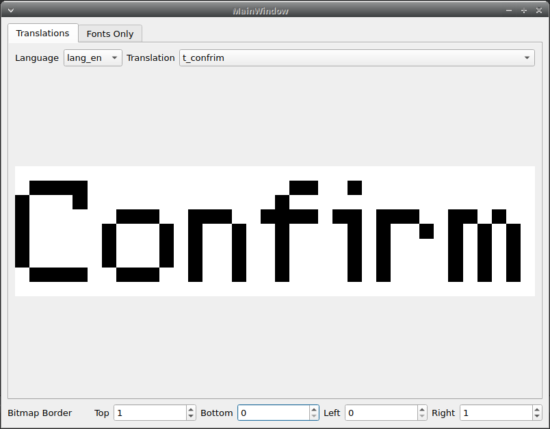
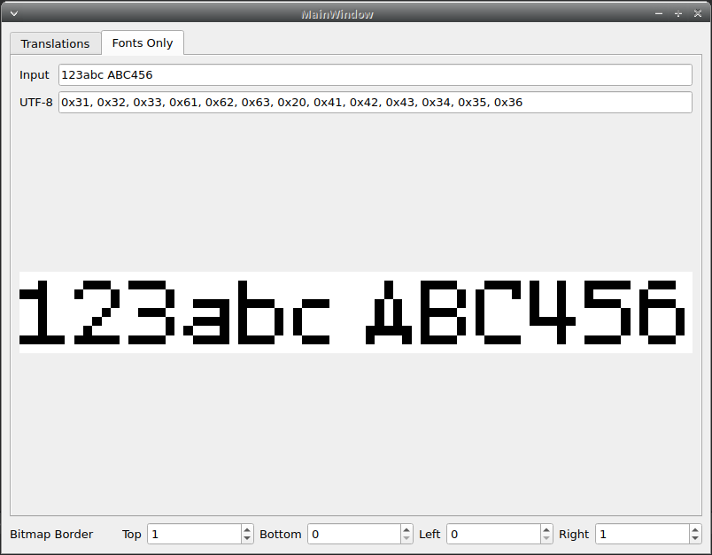

# Micro I18n Library

This library is designed for embedded applications where smaller binary size is crucial

Generator will generate a CMake library project, you could use that, or just use generated files directly

## Folder Structure

```yaml
    # This file
├── ReadME.md
    # Generator confgiuration
├── config.yaml
    # Scripts (well, the name is clear enough for what they do...)
├── scripts
│   ├── bootstrap.sh
│   ├── generate.py
│   └── requirements.txt
    # Usage demo made with Qt
└── usage_demo
│   ├──CMakeLists.txt
│   ├──main.cpp
│   ├──mainwindow.cpp
│   ├──mainwindow.h
│   ├──mainwindow.ui
│   └── microi18n.hpp
    # Input font in yaml format
├── fonts
│   ├── example.yaml
    # Input translations in yaml format
├── langs
│   ├── en
│       └── en.yml
    # Generated output files
├── gen
        # Important but FIXED codes, like macro and typedefs
    ├── microi18n_defines.h
        # .c/.h pair, generated enums, top level objects
    ├── microi18n.c
    ├── microi18n.h
        # If FONT_FULL is not defined, this control what font bitmap will be included
    ├── font_config.h
        # Generated bsase on what character is used in translations
        # .h Included all generated font, some FIXED codes used in FONT_FULL mode
        # .c Font bitmap structures, helper functions, used in FONT_FULL mode
    ├── font_support.h
    ├── font_support.c
        # Generated font bitmap .c/.h pair. Each font have it's own pair
    ├── fonts
    │   ├── example.c
    │   └── example.h
        # Generated language objects, only .c file
    ├── langs
    │   ├── en.c
        # Generated CMake based library project, check "usage demo" for usage
    ├── library
        └── CMakeLists.txt
```


## Usage Demo

This demo do not support text wrap and new lines, as those are made for test microcontroller screen drivers.

### Translation Mode


### Font Only Mode


## How to Build / How to Use

1. Install dependencies (which is python3, cmake, and qt5/6 if you want build usage demo)

2. Prepare your font and translation files in YAML format, put them in `fonts` and corresponding language folder under `langs`

3. Configure the correct path in `config.yaml` for files you added

4. Setup environment

```shell
./scripts/bootstrap.sh # only needed the first name
source ./scripts/.venv/bin/activate
./scripts/generate.py
```
5. Run the script to generate files, result will be in newly created `gen` folder

```shell
./scripts/generate.py
```

6. Add generated `.h/.c` files and include path to `gen` to your project

7. Compile

**For more details, check file format section below and `usage_demo` project**


## Translate File Format

The file is a standard YAML file, please use `langs/en/en.yml` as example, which is exported from `Lokalise` directly

**Note: the file ext name is '.yml', as this is default from `Lokalise`**

### Key Name Format

**Highly Recommended to Follow**

Basically take the **FULL** menu path connected with `-`, all lowercase, and with following prefixes

If a single element's name contains multiple words, use camel case with first letter set to lower case (e.g. t_longLongLongName)

For some odd cases, like USBHID you could use '_' seprate the name if you really want to (e.g. t_USB_HID)

As those names will be used for generate C variable name, do not put any character that is not valid for C variable name.

The maximum length for C variable name is 255, should be more than enough for most applications

`m_` - Menu/Sub-menu

`i_` - Item

`t_` - Text (Setting status(Enabled/Disabled)/Messages/Warnings/etc.)

If an element is used in multiple places (like Yes/No, Enable/Disable), put it under the root path, which means they have no `xxx-` ahead

**AVOID** use abbreviation in key names, unless the word is way too long or you really have to, this is mainly for avoid confusion

ie. `minutes`, you should use the full word `minutes`, don't short it to `min` (minmum? minute[s]?)

I know this make key name longer than most people like, but in this way we could quickly figure out what goes where, and we could sort both key list and translations

```
# Menu Path
Homescreen -> Dashboard -> Settings -> BlaBlaBla
# Translation Key
m_homescreen-m_dashboard-m_settings-i_blablabla
```

## Bitmap Font Format

The file is a standard YAML file, please use `fonts/bitmap_en.yaml` as example

**Note: the file ext name is '.yaml'**

## Legal

### License

This project is licensed under `CC BY-SA 4.0`, check `LICENSE.txt` for more details

### Disclaimer

THE SOFTWARE IS PROVIDED “AS IS”, WITHOUT WARRANTY OF ANY KIND, EXPRESS OR IMPLIED, INCLUDING BUT NOT LIMITED TO THE WARRANTIES OF MERCHANTABILITY, FITNESS FOR A PARTICULAR PURPOSE AND NON-INFRINGEMENT. IN NO EVENT SHALL THE AUTHORS OR COPYRIGHT HOLDERS BE LIABLE FOR ANY CLAIM, DAMAGES OR OTHER LIABILITY, WHETHER IN AN ACTION OF CONTRACT, TORT OR OTHERWISE, ARISING FROM, OUT OF OR IN CONNECTION WITH THE SOFTWARE OR THE USE OR OTHER DEALINGS IN THE SOFTWARE.